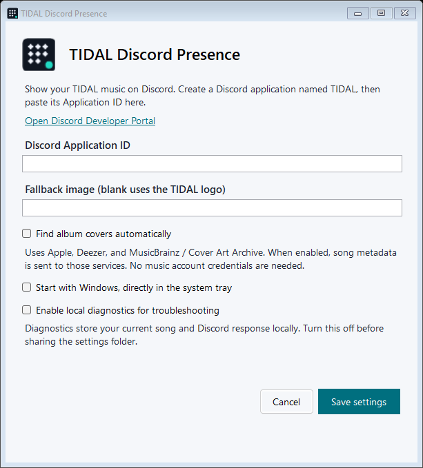

# TIDAL Discord Presence


Show what you are listening to in the **TIDAL desktop app** on your Discord profile. A small Windows tray companion with song details, a playback timer, album covers, and automatic reconnects.

[Download the latest release](https://github.com/GrantMatas/tidal-discord-presence/releases/latest) · [Report a problem](https://github.com/GrantMatas/tidal-discord-presence/issues) · [Changelog](CHANGELOG.md)

## Get started

1. Download **TidalDiscordPresence-1.0.2-win-x64.zip** from Releases and extract it to a permanent folder. The standalone EXE includes .NET; no SDK or runtime install is needed.
2. Run **TidalDiscordPresence.exe**.
3. Click **Open Discord Developer Portal** in setup. Create an application named **TIDAL**, open **General Information**, and copy its numeric **Application ID**.
4. Paste the ID into the app and save. No Discord password, bot token, account token, or client secret is needed.
5. Keep the **Discord desktop app** open and play a song in the **TIDAL desktop app**. Enable activity sharing under Discord's **Activity Privacy** settings.

The compact Discord activity status uses the current song and artist, for example **Listening to TIDAL • Before I Forget by Slipknot**, and updates when the song changes. The expanded card shows the album once on the smaller text line. Discord supplies the “Listening to” prefix. The expanded activity card's app name comes from your Developer Portal application; name it TIDAL. You only need to set this up once.



## What it shows

- Song title, artist, album, and a playback timer when TIDAL supplies a usable timeline.
- Album artwork, with the TIDAL logo as the default fallback.
- Paused status when playback is paused; the activity is removed when playback stops.
- Updated timing after seeking and reconnection when Discord restarts.
- A dedicated icon in the executable, app window, and Windows system tray.

Discord controls the activity card's layout and timer presentation. This companion does not add Spotify's native listening progress bar, listening parties, or account integration.

## System tray and Windows startup

The app continues running in the system tray after setup. If its icon is hidden, expand the tray with the **^** arrow.

- **Double-click** the icon, or choose **Settings**, to change options.
- **Pause sharing** hides the activity while music continues playing. Uncheck it to resume.
- **Open settings folder** opens the app's local configuration directory.
- **About** shows the installed version.
- **Uninstall…** removes the app and its Windows startup entry.
- **Quit** closes the companion and stops its Rich Presence connection.

To launch automatically after signing in to Windows, check **Start with Windows, directly in the system tray**, then save. The app registers a startup entry for your user account; administrator access is not needed. Startup opens the tray companion without a setup window.

Keep the EXE in its permanent folder. If you move it, open the moved copy and save Settings again to update the startup path. To disable automatic startup, uncheck the option and save.

## Album artwork and privacy

**Find album covers automatically** is optional and off initially. When enabled, song metadata is sent to public catalogs:

1. **Apple/iTunes** — matches the artist and track and prefers the current album.
2. **Deezer** — tries another catalog for the same track and artist.
3. **MusicBrainz / Cover Art Archive** — finds the album and artist and retrieves the album's cover.

A matching album from another provider is preferred over a compilation from the first provider. If only a different release of the same song is available, that artwork may be used. Edition labels such as “Special Edition” are normalized; live performances and remixes are not matched to the original recording.

Images are fetched and decoded before being sent to Discord. If a large image fails, a smaller image is tried. Broken URLs and non-image responses are skipped. Artwork loads in the background and old lookups are cancelled when the song changes. Missing covers retry after one minute. The tray menu shows the selected artwork source.

The app does not upload TIDAL's local thumbnail, read your music credentials, or require a music-service login. Public artwork URLs are passed to Discord, which downloads them through its own image proxy. Album covers depend on third-party catalog availability and are not guaranteed for every track.

Leave **Fallback image** blank to use the TIDAL logo. Optionally supply a public HTTPS image URL or an image asset key uploaded to your Discord application.

## Troubleshooting

| Problem | What to check |
| --- | --- |
| Nothing appears on Discord | Open the desktop clients, verify the Application ID, and allow sharing in Activity Privacy. |
| No album cover | Enable automatic album covers. If no catalog match is available, the TIDAL logo is used. |
| The app seems to disappear | It runs in the system tray; check the hidden icons. |
| No song is detected | Use the TIDAL desktop player and confirm Windows media controls show the song. Browser sessions are not selected. |
| No timer | TIDAL must expose a usable playback timeline. Paused tracks omit the running timer. |
| Startup stopped working after moving the EXE | Open the new copy and save Settings again. |
| Windows asks about an unknown publisher | The release is unsigned. Download from this repository, or build from source. |

Settings are stored at `%APPDATA%\TidalDiscordPresence\config.json`. **Local diagnostics** are off initially. Enable them only when troubleshooting; `status.json` includes the current song, requested image, and Discord acknowledgement. Turn diagnostics off to remove that report. Redact personal information before attaching diagnostics to an issue.

A read-only media-session check is available:

```powershell
.\TidalDiscordPresence.exe --diagnose .\diagnostics.json
```

## Uninstall

Choose **Uninstall…** from the tray menu, run **Uninstall.cmd** in the extracted folder, or launch `TidalDiscordPresence.exe --uninstall`. Confirm in the uninstall window. The app closes, removes its Windows startup entry, and deletes its release files. Files you have modified and unrelated files in the folder are preserved.

Settings are kept unless you check **Also remove my settings and local diagnostics**. No administrator access is needed. When using the standalone EXE without the ZIP, the uninstaller removes the EXE; the ZIP includes a manifest so its accompanying documentation and icons can also be removed.

## Requirements

- Windows x64: Windows 11, or Windows 10 version 2004 or newer.
- TIDAL and Discord desktop clients on the same PC.
- Internet access to Discord; public catalog access if artwork lookup is enabled.
- The release includes the current .NET 10 LTS runtime.

## Build and test

For development, install the **.NET 10 SDK** and use Windows.

```powershell
# Offline regression checks; no Discord or catalog access needed
dotnet run --project tests/TidalDiscordPresence.Tests/TidalDiscordPresence.Tests.csproj -c Release

# Standalone EXE, ZIP and SHA-256 checksums
.\tools\Build-Release.ps1
```

Release files are written to `artifacts/release/`. CI builds and runs the offline checks on Windows for each push and pull request.

Optional provider checks contact the public music catalogs and validate image downloads. After publishing, use **PowerShell 7.6+**:

```powershell
.\tests\Test-ArtworkProviders.ps1
```

The fixture is Korn's “Freak on a Leash” from “Follow the Leader”. Pass `-TrackReport .\diagnostics.json` to also test a song from a media-session report. Reports are local and excluded from Git.

To verify a release download:

```powershell
Get-FileHash .\TidalDiscordPresence.exe -Algorithm SHA256
```

Compare the result with **SHA256SUMS.txt** from the same release.

## License and credits

The companion's source is available under the [MIT License](LICENSE). TIDAL, Discord, provider logos, and album artwork remain the property of their respective owners. This is an independent project and is not affiliated with or endorsed by TIDAL or Discord.

Technical references: [Windows media sessions](https://learn.microsoft.com/en-us/uwp/api/windows.media.control.globalsystemmediatransportcontrolssessiontimelineproperties), [Discord RPC](https://github.com/discord/discord-api-docs/blob/main/developers/topics/rpc.mdx), [Apple search API](https://developer.apple.com/library/archive/documentation/AudioVideo/Conceptual/iTuneSearchAPI/UnderstandingSearchResults.html), [MusicBrainz API](https://musicbrainz.org/doc/MusicBrainz_API), and [Cover Art Archive API](https://musicbrainz.org/doc/Cover_Art_Archive/API).
